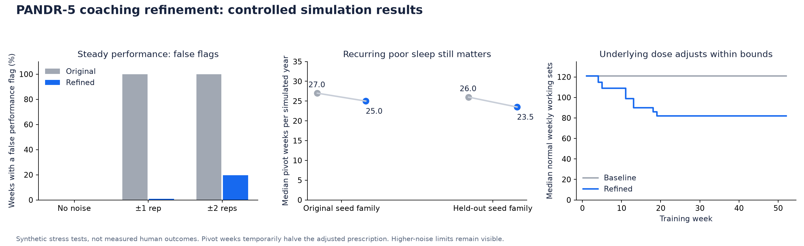

# PANDR-5 coaching refinements: results

Implemented within the existing split, fractional credits, rep/RIR rules, 2–5% increases, 2–3% reductions and two-flag pivot rule. The extra trend and recovery thresholds are documented app policies informed by research; they are not validated physiological cutoffs.

## What changed

- Performance: a confirmed drop or repeated downward trend across five comparable exposures replaces a single lower anchor. Changed prescriptions, missing anchors and long gaps reset the comparison. Reports from the user still count.
- Equipment: exact lists of real loads and visible adjustment requirements replace ambiguous rounding holds. Hardware gaps are never filled with an oversized jump or fictional microplates.
- Bodyweight: recorded resistance plus confirmed added/assistance options can progress through assisted, unassisted and added-weight modes. One-time setup is necessary; the app never supplies a universal body-mass fraction.
- Recovery: repeated qualifying trouble allows small normal-volume reductions within 10–20 effective sets for selected muscles. Restored recovery and attendance allow slow restoration to the saved plan. Adjustments start next week. Early RIR targets and the exact anchor/finisher are preserved. Pivots still apply; original plan counts remain the ceiling.

## What the comparisons show

With ordinary ±1-rep noise and no real decline, the original detector flagged 1,920/1,920 eligible weeks (100.00%). The refined detector flagged 19/1,920 (0.99%). This is a controlled synthetic false-flag rate, not a human diagnostic accuracy estimate.

All 40 clear abrupt-decline controls and all 40 clear gradual-decline controls were detected. In the noiseless examples, detection followed the onset by 1 weekly exposure for an abrupt drop and 2 for a gradual decline. Requiring confirmation costs time. With ±2-rep stationary noise, false flags still occurred in 379/1920 weeks (19.74%); the rule is not robust to every noisy logging pattern.

| Poor-sleep group | Original controller: median pivot weeks | Refined controller | Normal sets at week 52, original → refined |
|---|---:|---:|---:|
| original seeds | 27 | 25 | 121 → 82 |
| held-out seeds | 26 | 23.5 | 121 → 82 |

The recurring-sleep problem is only partially resolved. The controller reduces a repeatedly excessive dose, but does not suppress symptoms or break the volume floor to make pivot counts look better. The previous audit’s median of 25 weeks came from the original single-stream harness; the matched rerun baseline above uses the corrected independent streams. These numbers must not be mixed as if the inputs were identical.

The sleep scenario is deliberately harsh and uncalibrated. Its fatigue recurrence includes a 0.45 poor-sleep penalty with 0.48 carryover; under continuously poor sleep, even a hypothetical zero-training steady state produces readiness around 0.907, below the simulator’s 0.91 reporting threshold. That arithmetic explains why training-volume changes alone cannot erase many flags in this simulator. It does not establish that a real person needs this many reduced weeks.

Across the 240 refined people-years there were 106 bounded reductions, 17 restorations and 204 check-ins that correctly reported no further valid whole-set reduction. Calibrated bodyweight setups produced 611 mode transitions; separate tests cover assistance → unassisted → added load and the reverse direction. All recommended changes stayed inside the source percentage limits.

A 10 kg working load with only 2.5 kg steps still stays at 10 kg after 12 successful cap exposures: 12.5 kg is a 25% jump. Providing a real 10.25 kg option permits 2.5% progression. This is an honest physical requirement, not an algorithmic stall that repeated success can overcome.

The 12 zero-adaptation controls acquired no positive latent capacity. Their highest person-level mean external-load change was -0.212%. The report also retains 60 response/noise sensitivity runs and 12 uncalibrated bodyweight comparisons. Better-looking load numbers were not a passing condition.

## Verification

155 automated checks passed, including original-source parity, recovery floors/ceilings, exact effort preservation, genuine decline detection, equipment boundaries, unit conversion, immutable history and backups. All 13 desktop/mobile browser flows passed; the three affected coaching flows were rerun after the final effort-preservation fix. The live web app’s new Settings and Method screens were inspected without changing the owner’s training data. The catalog and web/PWA build passed. Seven 0.4.0 desktop files built successfully for Windows, Linux, Apple Silicon Mac and Intel Mac. The Apple Silicon download checksum matched its GitHub asset digest; its 0.4.0 application opened successfully and displayed the new recovery controls. Other native runtimes were not exercised here.

The [real account run](https://github.com/JCarterJohnson/PANDR-5/actions/runs/35536953930) passed all 12 shards: 120 separate Auth accounts, 27,081 workouts, 5,787 check-ins, 35,566 cloud saves, 2,462 individual-set saves and 1,673 fresh restores. All 6,360 weekly and 214,650 exercise snapshots exactly matched the production-engine run. 12 pre-write failures, 12 lost acknowledgments and 12 device conflicts recovered as expected; 336 isolation assertions passed. Every account passed exact session/check-in CSV and full-backup round trips. No production users or votes were changed.

## Methods and limits

There are 240 distinct synthetic people across two seed families, each run through both controllers: 480 paired people-years. The 120 real-backend years repeat the first refined group for storage validation; they are not another independent human sample. Life events, schedules and attendance match exactly between controller versions. Latent adaptation/fatigue equations and coefficients were kept from the original simulator. Random streams were separated by life week, attendance, check-in and exercise/set to prevent altered prescriptions from changing later random events.

The bodyweight simulation exposes its original 70%-of-mass mechanical assumption as a known synthetic measurement, with explicitly listed 1.25 kg added/assistance options. Both paired controllers receive that same setup. This is not a recommended coefficient in the app. Ordinary externally loaded exercises in the coarse cohort retain their 2.5 kg grid; calibrated bodyweight options are a separate setup, and do not demonstrate that coarse external equipment has been fixed. Initial bodyweight/assistance slots are excluded from the external-load-change summary so mode changes cannot divide by a zero starting load.

The frozen baseline comes from commit 12c12b8, with imports relocated only. Production coaching was tested at b40d141; the 0.4.0 tag includes subsequent release-workflow changes. The full formulas, conservative thresholds and research limitations are in [the rationale](../../../docs/coaching-refinements.md). Reproduction is in [the audit README](../README.md).

This establishes implementation behavior and some useful plausibility checks. It does not prove human hypertrophy, injury safety, optimal set targets or a fully autonomous coach. Real users must still report performance/recovery accurately and keep equipment/bodyweight setup current. Longitudinal human validation remains necessary.

## Reviewable evidence

- [Cohort comparison](cohort-comparison.csv)
- [All paired account summaries](paired-accounts.csv)
- [All detector controls](detector-controls.csv)
- [Download the complete synthetic evidence bundle](https://github.com/JCarterJohnson/PANDR-5/releases/download/v0.4.0/PANDR-5-0.4.0-coaching-audit.zip): account backups, weekly/exercise series, response/noise controls, checksums and reproduction source. The same data is in the ignored results folder.

## Research informing the policy

- [Steele et al.: prediction error near failure](https://pmc.ncbi.nlm.nih.gov/articles/PMC5712461/) — supports treating effort/repetition estimates as imperfect; does not validate our thresholds.
- [Suprak et al.: supported body mass in push-up positions](https://pubmed.ncbi.nlm.nih.gov/20179649/) — supports setup-specific resistance, not a universal bodyweight conversion.
- [Bell et al.: deloading Delphi consensus](https://link.springer.com/article/10.1186/s40798-023-00633-0) — supports individualized stress reductions; exact prescriptions remain weakly evidenced.
- [Coleman et al.: a week of complete training cessation](https://pubmed.ncbi.nlm.nih.gov/38274324/) — a different intervention from PANDR-5 half-volume pivots; it cannot validate or disprove this controller.
