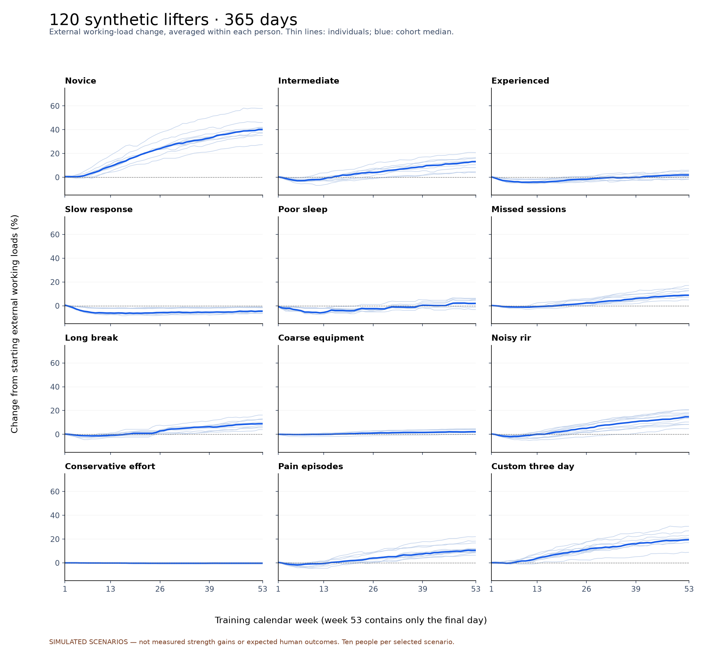

# PANDR-5: one-year simulation audit

## Result

**The account and progression software completed the test. The stronger claim that it can manage every lifter's training automatically is not supported.** The current rules are coherent in several important ways, but equipment limitations, reporting noise, repeated recovery problems and bodyweight progression still require human decisions.

Completed **120 synthetic accounts × 365 days**, **27,153 workouts**, **5,809 check-ins**, and **189,594 exercise recommendations**. No production users or training data were used. [Completed backend run](https://github.com/JCarterJohnson/PANDR-5/actions/runs/35532952668). Tested application commit: `f63467cf454360f1742b3a49a1c582b435ab1d86`.

These numbers describe invented participants under explicit assumptions. They do not estimate expected gains, prove safety, measure hypertrophy, compare PANDR-5 with another program, or substitute for observing real users.

## What a year looked like

“Working-load change” is the average percentage change across a person's externally loaded exercise slots. It is **not a measured 1RM gain**, a pooled average of kilograms across different exercises, or a muscle-gain estimate. Assistance and bodyweight slots are excluded from this particular summary but included in the actual sessions and checks. Each row contains ten deliberately chosen scenario participants; this is not a representative population sample.

| Scenario | Median workouts | Median working-load change | Individual range | Median pivot weeks | Recommendations held by equipment |
|---|---:|---:|---:|---:|---:|
| novice | 250 | +40.1% | +27.5 to +57.9% | 1 | 1.9% |
| intermediate | 244 | +13.1% | +3.9 to +20.8% | 1 | 3.3% |
| experienced | 248 | +1.9% | -1.6 to +5.9% | 1 | 7.5% |
| slow-response | 236 | -4.5% | -6.5 to -0.9% | 1 | 13.8% |
| poor-sleep | 244 | +2.0% | -3.1 to +6.4% | 25 | 5.3% |
| missed-sessions | 168 | +8.9% | +4.9 to +17.1% | 0.5 | 6.5% |
| long-break | 218 | +8.9% | +4.0 to +16.2% | 0 | 7.4% |
| coarse-equipment | 242 | +2.2% | -0.2 to +4.7% | 1 | 41.1% |
| noisy-RIR | 244 | +14.7% | +4.9 to +20.7% | 1 | 2.9% |
| conservative-effort | 238 | -0.3% | -0.9 to -0.2% | 1 | 0.1% |
| pain-episodes | 245 | +10.6% | +6.4 to +22.0% | 3.5 | 4.2% |
| custom-three-day | 148 | +19.6% | +8.9 to +30.7% | 1 | 4.9% |

Normal weekly set allocations stayed fixed. Pivot weeks reduced sets and paused load progression. Missed training and a six-week interruption created gaps rather than invented catch-up workouts; a new cycle preserved earlier history. Working loads sometimes stayed flat or decreased. There was no unbounded exponential increase.

## Practical findings

### 1. The automatic performance flag is sensitive to ordinary noise

In an independent control, underlying strength, loads, effort targets and training prescriptions were unchanged. Anchor repetitions varied randomly by only −1/0/+1. The current “decline on at least two exercises” flag fired in **199 of 199 evaluated weeks**.

This flag alone does **not** cause a pivot. With poor sleep also checked, however, the same control met the next-week pivot rule in **199 of 199 weeks**. With many exercise slots, two small downward comparisons are easy to obtain by chance. This is a negative-control finding, not a real-world false-positive rate. The control keeps prescriptions fixed to isolate the detector; it is not a full closed-loop pivot simulation.

Recommendation: review the automatic corroboration rule before describing it as reliable evidence of declining performance. A repeated trend and a meaningful-change requirement are candidates for testing. No new cutoff was silently substituted during this audit, and any change should be reconciled with the source model and tested prospectively.

### 2. Equipment can block progression indefinitely

At 10 kg with 2.5 kg steps, the next increment is 25%, outside the model's permitted increase. Even repeated successful cap-reaching therefore returns “hold”; the 12-exposure control remained at 10 kg throughout. With 0.25 kg steps, the same performance produces an increase.

In the coarse-equipment cohort, **41.1% of all exercise recommendations** held because no valid increment existed. Small reductions can also be impossible. This follows the specified percentage rules, so passing the formula tests does not solve the practical problem. The app already explains the hold, but cannot supply equipment the user lacks. A reviewed fallback or a clearer setup intervention is needed for hands-off use.

### 3. Chronic poor recovery can mean repeated pivot weeks

The poor-sleep scenario had a median of **25 pivot weeks** out of the simulated year. That is understandable under repeated symptoms, but the app does not automatically redesign the five-day schedule or ordinary volume. In this scenario, **46.5%** of completed progression anchors were below the rep floor. Continued check-ins do not resolve the underlying sleep/recovery constraint.

### 4. The system needs believable effort reporting and some manual choices

The conservative-effort cohort intentionally stopped earlier than prescribed. Its median working-load change was **-0.3%**, with **72.6%** of completed anchors below the rep floor. Many anchors could not satisfy the required RIR condition. This is not proof that those people cannot improve; it shows how strongly the prescription depends on its effort input.

Bodyweight movements can exceed the repetition cap while the app correctly keeps external load at zero. Users must choose added load, assistance changes or a harder variation themselves. Pain-limited work was skipped by the simulated lifter; the simulation did not test whether continuing through pain is safe.

## Account/storage verification

- **120 distinct real test Auth accounts** across twelve isolated local Supabase databases; all 120 profiles and **32,962 immutable record versions** were counted on the databases.
- **35,792 successful routine production-code sync checkpoints**, including **2,591 individual-set saves** in sampled first/last full weeks, plus the separate conflict checks. Every completed workout and check-in was saved; every individual set-save was not replayed for every account.
- **1,674 successful fresh-memory/fresh-client restorations**, with full data equality checks.
- **12 pre-write failures** and **12 lost acknowledgements after commit** recovered without losing session history.
- **12 two-device conflicts** were detected and the winning server data preserved.
- **336 account-isolation assertions** passed, including denied cross-account inserts and anonymous reads.
- All 120 final JSON backups and all-time CSV session/check-in payloads round-tripped. Every collected backup's SHA-256 checksum and record counts were independently checked after downloading the run logs.
- Normal-volume invariance, FSA sums, assistance direction, valid percentage steps, incomplete-anchor holds, pivot holds, cycle ownership and weekly check-in uniqueness passed.
- All 120 account outcome summaries, **6,360 weekly observations**, and **214,650 per-exercise snapshots** exactly matched the equivalent engine-only run. Saving and restoring accounts did not change the simulated training decisions.

The per-runner 95th-percentile save times ranged from **211 to 285 ms**. These include validation, hashing, data merging and local HTTP/database calls. They are not production latency or a concurrent-user benchmark. Across the runs, the instrumented clients sent approximately **1.68 GB** and received **2.78 GB** of HTTP bodies, including injected failures and reads. Immutable workout payloads are incremental, but profile metadata and the history manifest still travel repeatedly. That matters when considering free-hosting capacity over time; this audit does not establish that live quotas will support unlimited users.

## How much the assumptions matter

Sixty paired sensitivity runs changed response ceilings and noise while keeping seeds/scenarios matched. For one novice, the three response assumptions produced **base: +40.9%, half-response: +17.6%, higher-response: +63.7%**. The simulator can readily change the annual gain by changing its biological assumptions. That is why numerical similarity to a plausible human outcome is a screening check, not scientific validation.

An additional twelve full-year controls set adaptation to zero, one participant per scenario. Average external working-load changes ranged from **-9.6% to -0.4%**; none showed an average increase. This is a useful check against automatic upward drift when the participant does not become stronger. It is still conditional on this particular simulator, and does not establish that the app always detects nonresponse in humans.

The simulator uses diminishing latent capacity growth, fatigue, missed work, illness, RIR error and a simple detraining mechanism. The detailed equations, parameter ranges, limitations and primary research supporting the scenario choices are in [the methodology](../README.md). The default source exercises and one custom three-day schedule were exercised; this is not exhaustive coverage of all 372 catalog entries, every training plan, or every browser interaction. The existing 125 app tests also passed during the audit.

## Files and reproduction

- [Cohort summary CSV](cohort-summary.csv)
- [All 120 account summaries](account-summary.csv)
- [Backend verification totals](backend-evidence.json)
- [Sensitivity and negative-control evidence](control-evidence.json)
- [Full methods and rerun instructions](../README.md)
- Local full evidence: `research/simulation/results/verified/` contains account and weekly CSVs, compressed per-lift trajectories, the combined backend report and **120 compressed complete account backups**. These large generated files are ignored by Git but preserved in the completed run's synthetic log bundles.
- Local sensitivity/control evidence: `research/simulation/results/probes/probes.json`.
- The app's progression rules and real production records were not changed to obtain a passing simulation.

## Assessment

**Suitable as a transparent, rule-based training log with guided progression; not yet demonstrated as a fully hands-off adaptive coach.** The highest-priority review is noise sensitivity in automatic performance corroboration, followed by equipment deadlocks and repeated-pivot guidance. After those decisions are addressed, a small prospective real-user pilot with clearly defined outcomes would test what simulation cannot: adherence, usability, tolerability and actual training results.
